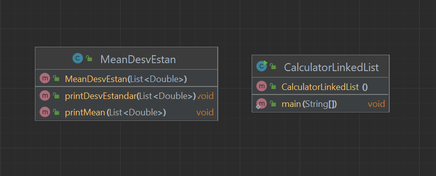
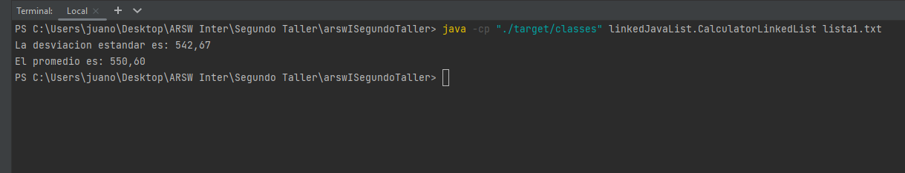

# Linked List
## ARSW
### Autor

- Juan Monroy

### Fecha
- 10 Junio 2022

## Diagrama de clases

La clase CalculatorLinkedList recibe el argumento file y lee las lineas de texto de los archivos
La clase MeanDesvEstan recibe los argumentos por medio de una linkedList y calcula y retorna
la desviación estandar y el promedio de la lista de numeros


### Funcionalidad



### Ejecutar el programa
```
java -cp "./target/classes" linkedJavaList.CalculatorLinkedList lista1.txt
```

### Generar JavaDoc
```
mvn javadoc:javadoc
```
